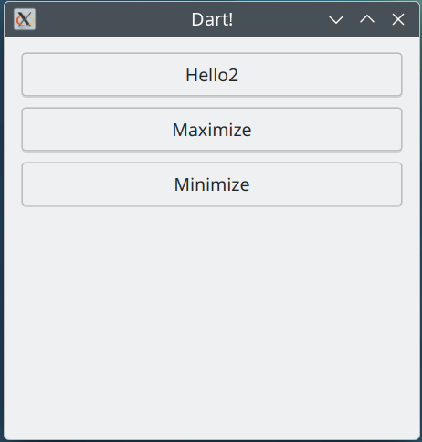

# dart-qtbindings

This is a proof of concept of Qt bindings for Dart.

The goal is only to showcase the C++ binding generator for Dart, Dartagnan.<br>
There's no intention in creating production ready Qt bindings.



# Build

```bash
cmake .
cmake --build .
```

You now have a Qt bindings library: `generated/QtDartBindings/libQtDartBindings.so`
These are the C wrappers produced by our dart generator.

# Run

`libQtDartBindings.so` needs to be in your library path, so edit PATH (Windows), LD_LIBRARY_PATH (Linux)
or DYLD_LIBRARY_PATH(macOS). On mac you'll need to disable system integrity protection though.

Or alternatively, edit:
```bash
generated/QtDartBindings/dart/lib/Bindings.dart:    _dylib = ffi.DynamicLibrary.open('libQtDartBindings.so');
```

and use an hardcoded absolute path in the source.

On Linux, it's just:
```
export LD_LIBRARY_PATH=build-dev/generated/QtDartBindings/:$LD_LIBRARY_PATH
```

Now run:

```
cd app
dart pub get # Could this be done automatically ?
dart run bin/main.dart
```

# Regenerating the Bindings

Be sure to build and install `dartagnan` and put it in path.

Then run:

```
dart pub get
dart refresh_bindings.dart
```

# Repo Layout


`app/`
    Our dart test app, which shows a Qt window.

`generated/`
    Contains all the code generated by shiboken.
    Includes the dart classes which users will use, and also the intermediate
    C and C++ glue which calls the target C++ code.

`typesystem.xml`
    Used by shiboken, at "binding generation time".
    The file for configuring the shiboken generation. Lists all classes we want bindings.for

`bindings_global.h`
    Used by shiboken, at "binding generation time". Includes all headers we want bindings for.

`shiboken_snippets/`
    Sometimes shiboken needs a little help and we can provide some snippets for it, so we say
    exactly what we want generated.


# Known Issues

* macOS: "NSWindow drag regions should only be invalidated on the Main Thread!"
  See https://github.com/dart-lang/sdk/issues/38315 , patches welcome


![Build Status](https://github.com/KDABLabs/dart-qtbindings/actions/workflows/build.yml/badge.svg
